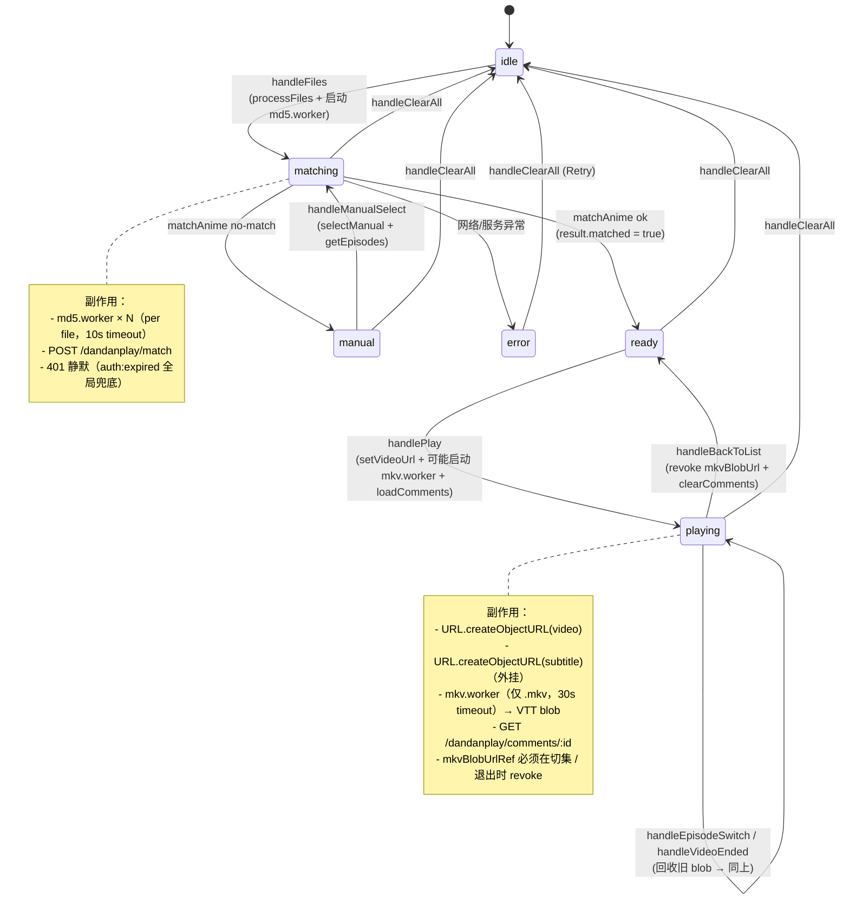
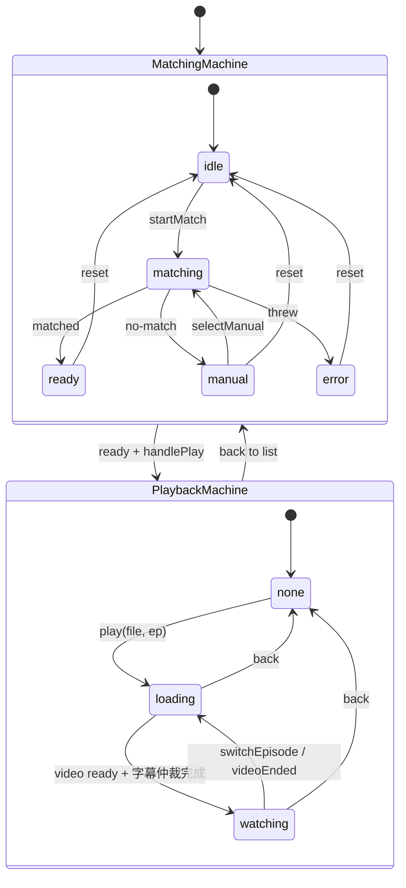

# PlayerPage 状态机

> 目的：把 `client/src/pages/PlayerPage.jsx` 当前耦合的 7 块职责画清楚，作为后续拆分/重构的对图基线。
> 生成于 2026-04-18 retro，对应代码版本 v1.0.6。

---

## 一、当前状态机（as-is）



> 注意：**`uiPhase` 是 `playingFile ? 'playing' : phase` 的派生值**，所以 `playing` 不是 `useDandanMatch` 内部状态，而是 PlayerPage 叠在外面的一层 UI overlay。这是当前 churn 的根源之一——状态机被劈成了两个所有者。

---

## 二、当前 PlayerPage 拥有的 7 块职责

| # | 职责 | 当前实现位置 | 状态归属 |
|---|------|--------------|----------|
| 1 | 文件投递 / 解析 | `useVideoFiles` hook | hook 内 |
| 2 | dandanplay 三段匹配 | `useDandanMatch` hook | hook 内 |
| 3 | 弹幕评论加载 | `useDandanComments` hook | hook 内 |
| 4 | **播放会话**（playingFile/Ep/videoUrl） | PlayerPage 6 个 useState | **页面级** |
| 5 | **字幕来源仲裁**（外挂 vs MKV embedded） | `handlePlay` 内联 worker + ref | **页面级** |
| 6 | **MKV blob 生命周期** | `mkvBlobUrlRef` + 多处 revoke | **页面级** |
| 7 | DanmakuPicker 模态触发 | `pickerEp` useState | **页面级** |

**问题**：4/5/6 是同一个会话生命周期的 3 个面向，但散落在 6 个 useState + 1 个 ref + 3 个 effect 里。每次切集（`handleEpisodeSwitch → handlePlay`）都要手动同步它们，漏掉一个就泄漏 blob 或残留旧字幕。本周 7 次修改 `EpisodeFileList` + 10 次修改 `PlayerPage` 大部分都是为了把这套手动同步擦干净。

---

## 三、目标状态机（to-be）



**关键变化**：把"播放会话"从 PlayerPage 抽出去成独立 hook `usePlaybackSession`，让 PlayerPage 只负责按 `(matchPhase, playbackPhase)` 二元组渲染对应组件，不再持有 blob、worker、字幕 url 这类生命周期对象。

**所有权契约**：`usePlaybackSession.play(file, ep)` 对 `MatchingMachine` **只读**——它读 `matchResult.episodeMap` 决定弹幕加载，但不会回调改 `MM.phase`。反向的 `back()` 也只清自己的状态，不 reset MM。两台机器靠 PlayerPage 在外面用 `(matchPhase, playbackPhase)` 二元组组合渲染，不互相通信。

---

## 四、推荐拆分（小步可做）

### Step 1（30 min）：抽 `usePlaybackSession`

把这 6 个 state + 1 个 ref + mkv.worker 启动逻辑全部搬进新 hook：

```js
// client/src/hooks/usePlaybackSession.js
export default function usePlaybackSession({ getVideoUrl, getSubtitleUrl }) {
  // 内部 state: phase ('none'|'loading'|'watching'), file, ep,
  //             videoUrl, subtitleUrl, subtitleType, subtitleContent
  // 内部 ref:   mkvBlobUrlRef
  // 暴露 API:   play(fileItem, episodeMap), back(), switchEpisode(epNum, files, episodeMap)
  // 卸载时:     revoke 所有 blob
}
```

收益：
- PlayerPage 从 **419 行**（v1.0.6 实测，前文 ~340 是上周数据）降到 ~200 行
- mkv blob 生命周期收敛到一个地方，**`useDandanMatch` 5 次修改 0 测试**的债可以从这里开始还（hook 抽出来后好测）

**Step 1 验收门槛**：完成后必须存在 `client/src/hooks/__tests__/usePlaybackSession.test.js`，且以下 5 个 case 全过：

| 测试名 | 验证不变量 |
|---|---|
| `play() then back() revokes blob` | #1 |
| `switchEpisode terminates pending mkv worker` | #6（新增，见第五节） |
| `unmount during worker pending revokes blob` | 内存泄漏 |
| `external subtitle skips mkv worker entirely` | resolveSubtitle 分支 |
| `null episodeMap → no comments load, no crash` | 边界 |

测试不齐 = Step 1 不算完，不进 Step 2。

### Step 2（15 min）：把字幕仲裁单独抽

`handlePlay` 里的字幕分支（外挂 → 直接用，没有 → 跑 mkv.worker）抽成 `resolveSubtitle(file)`：

```js
// client/src/utils/resolveSubtitle.js
export async function resolveSubtitle(file, externalSubtitle) {
  if (externalSubtitle) return { type: externalSubtitle.type, url: externalSubtitle.url };
  if (!/\.mkv$/i.test(file.name)) return null;
  // 跑 worker，30s timeout，返回 { type, url, content?, blobUrl }
}
```

可独立测试，这是补 `mkvSubtitle.worker.js`（263 行 0 测试）覆盖率的入口。

### Step 3（15 min）：DanmakuPicker 触发器抽 `useDanmakuPicker`

只是把 `pickerEp` + 开关回调收成一个 hook，让 PlayerPage 的 JSX 干净一档。优先级最低，但顺手就做了。

---

## 五、不变量（refactor 时必须保住）

写这页就是为了让下一次重构有"对图依据"。任何拆分必须满足以下不变量，否则就引入了回归：

1. **每次切集，旧 mkv blob 必须 revoke**——当前靠 `mkvBlobUrlRef.current` 在 `handlePlay` 和 `handleBackToList` 双点 revoke。新 hook 里集中到一处。
2. **`uiPhase === 'playing'` 当且仅当 `playingFile != null`**——`useDandanMatch` 仍是 ready，但 UI 切到 playing。新设计中 `playbackPhase !== 'none'` 即覆盖 match phase 的渲染。
3. **401 不渲染 error 页**——`useDandanMatch` 已经在 catch 里跳过 401，全局 `auth:expired` 接管。新 hook 必须保留这个例外。
4. **mobile guard 必须在所有 hooks 之后**——`isMobileView` 早 return 会触发 hook-order 崩溃，本周已经踩过一次（`8fc6de5`）。
5. **DanmakuPicker 在 list view 和 playing view 都能开**——所以 `pickerEp` 和播放状态正交，不能合并。
6. **切集时旧 mkv.worker 必须 terminate**——当前代码（`PlayerPage.jsx:191-212`）只在 worker 自己回包/onerror 时才 terminate，30s timeout 也只 terminate 不 cancel onmessage。结果是：用户连续切集，前一集的 worker 5s 后回包会污染当前集字幕。新 hook 必须挂 `currentWorkerRef`，每次 `play()` 入口先 `terminate()` 上一个。这条不是 refactor 引入的，是当前就存在的 race，借这次抽 hook 顺手修。

---

## 六、不要做的事（YAGNI 边界）

- **不要引入 XState 或别的状态机库**——两个 hook 各自的 phase 用 useState 完全够用，3 个 phase 5 条边的状态机引外部依赖是吃力不讨好。
- **不要把 useVideoFiles 一起重构**——它现在只管 File[] 解析，职责清楚，churn 不在它身上。
- **不要"顺手"重写 VideoPlayer**——本周已经动过它（c58e09e + 26821ef），状态稳定，碰它就是新一波 fix 链。
- **不要顺手拆 `useDandanMatch`**——它已经稳定且有测试（`useDandanMatch.test.jsx`）。等 Step 1 完成、`usePlaybackSession` 测试齐了之后再判断要不要动它。一次只动一台机器。

---

**下一步**：如果同意这个拆分方向，先做 Step 1（抽 `usePlaybackSession`），完成后给它写 unit test（mock `getVideoUrl` + 触发 mkv.worker 假回包），把测试比例往上拉一点。
